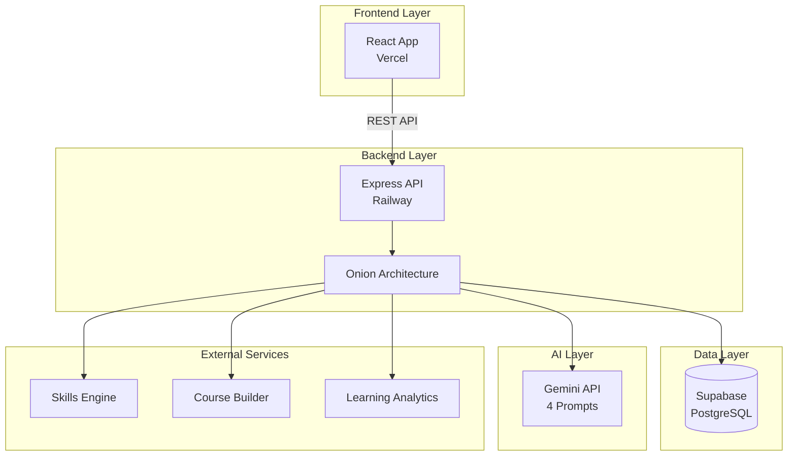
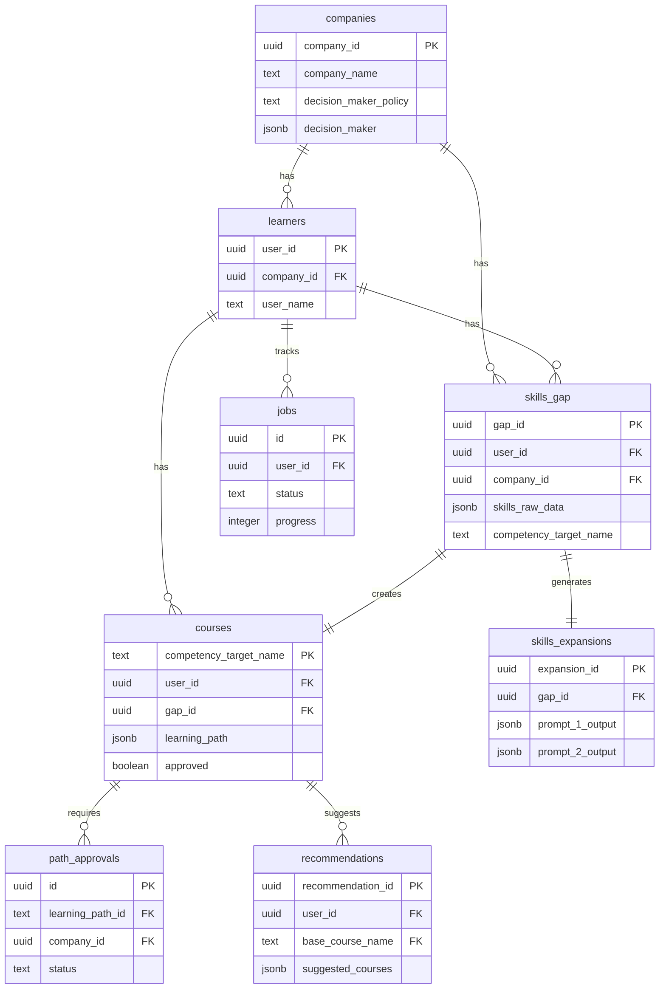
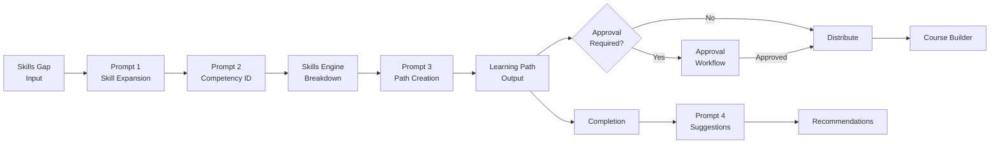
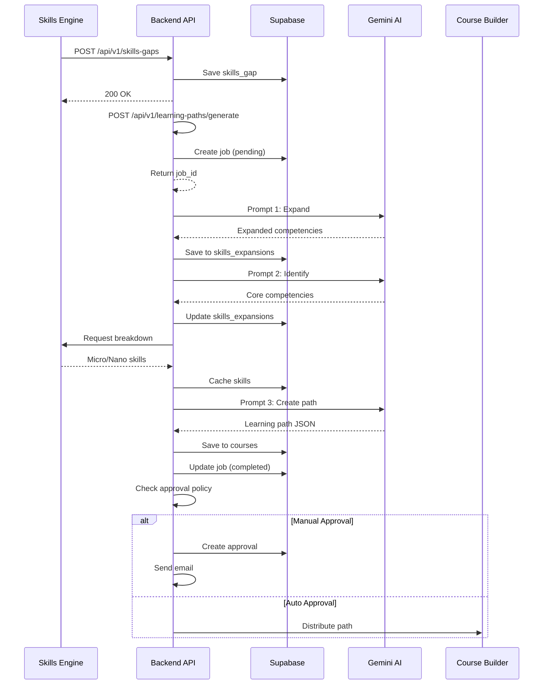
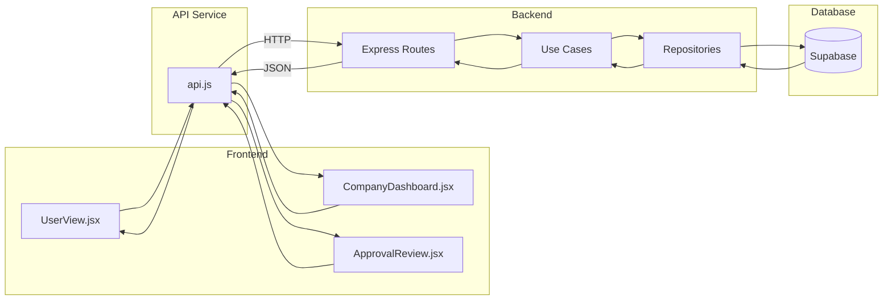
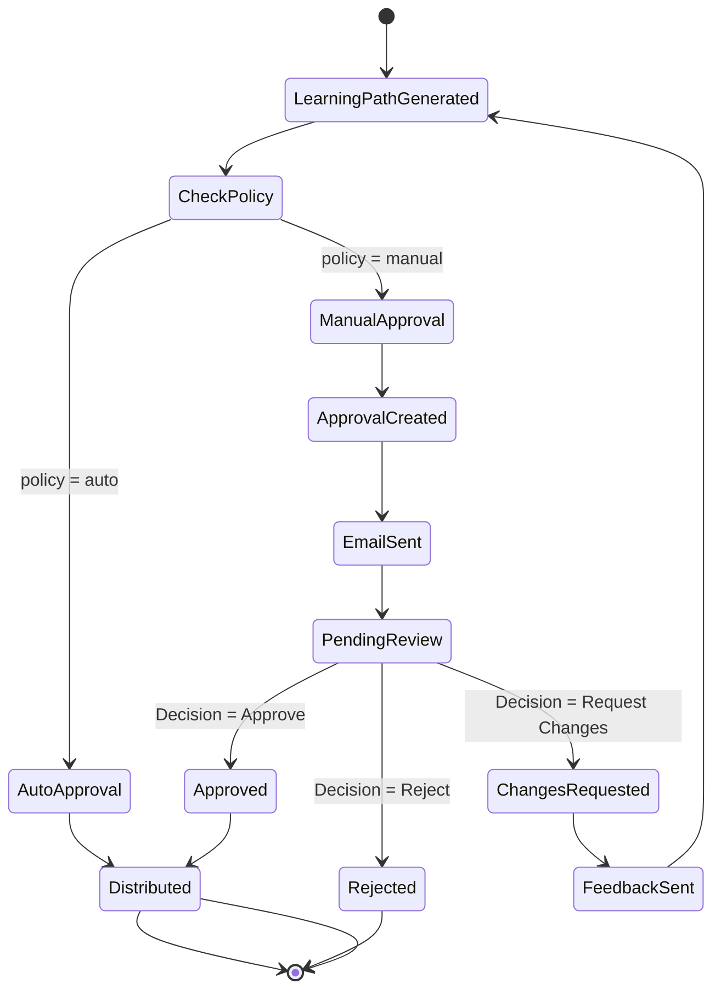

# 📊 Presentation Diagrams
## Ready-to-use diagrams for your presentation

---

## Architecture Diagram (Mermaid)



---

## Database Schema Diagram (Mermaid)



---

## AI Prompt Pipeline Flow (Mermaid)



---

## Data Flow Diagram (Mermaid)



---

## Frontend-Backend Communication (Mermaid)



---

## Approval Workflow (Mermaid)



---

## Use These Diagrams

1. **Copy the Mermaid code** into:
   - GitHub (renders automatically)
   - Mermaid Live Editor: https://mermaid.live
   - VS Code (with Mermaid extension)
   - Notion, Obsidian (supports Mermaid)

2. **Export as images:**
   - Use Mermaid Live Editor to export PNG/SVG
   - Use in PowerPoint/Keynote
   - Embed in presentation

3. **Customize:**
   - Change colors
   - Add your branding
   - Modify labels
   - Add animations

---

## Quick Stats for Slides

```
📊 Database:
- 8 Tables
- 20+ Indexes
- 5 Foreign Keys
- 3 JSONB Fields

🔌 API:
- 15+ Endpoints
- RESTful Design
- 4 Resource Groups

🤖 AI:
- 4 Prompts
- Sequential Pipeline
- Gemini API

⚛️ Frontend:
- 4 Main Pages
- 8 Components
- Dark Mode Support

🏗️ Architecture:
- Onion Architecture
- 10 Use Cases
- 9 Repositories
- 12 Microservice Clients
```

---

## Color Scheme (Use in Diagrams)

- **Primary**: `#047857` (Teal)
- **Secondary**: `#0d9488` (Cyan)
- **Accent**: `#d97706` (Gold)
- **Success**: `#10b981` (Green)
- **Warning**: `#f59e0b` (Orange)
- **Error**: `#ef4444` (Red)

---

## Presentation Tools

1. **Mermaid Live Editor**: https://mermaid.live
   - Edit diagrams
   - Export as PNG/SVG
   - Share links

2. **Excalidraw**: https://excalidraw.com
   - Hand-drawn style diagrams
   - Collaborative
   - Export as PNG

3. **Figma**: https://figma.com
   - Professional diagrams
   - Custom branding
   - Export high-res

4. **Draw.io**: https://app.diagrams.net
   - Flowcharts
   - ERD diagrams
   - Architecture diagrams

---

Good luck with your presentation! 🚀

